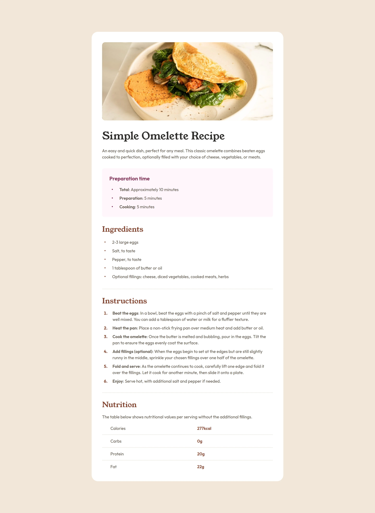

# recipe-page
This is a solution to the [Recipe page challenge on Frontend Mentor](https://www.frontendmentor.io/challenges/recipe-page-KiTsR8QQKm).

## Table of contents

- [Overview](#overview)
  - [Screenshot](#screenshot)
  - [Links](#links)
- [My process](#my-process)
  - [Built with](#built-with)
  - [What I learned](#what-i-learned)
  - [Continued development](#continued-development)
  - [Useful resources](#useful-resources)
- [Author](#author)

## Overview

### Screenshot



### Links

- Solution URL: [github.com/rizanne-f/recipe-page](https://github.com/rizanne-f/recipe-page)
- Live Site URL: [rizanne-f.github.io/recipe-page/](https://rizanne-f.github.io/recipe-page/)

## My process

### Built with

- Semantic HTML5 markup
- CSS custom properties
- Flexbox
- Mobile-first workflow

### What I learned

I noticed that the list item bullets are smaller in the design compared to the default size. To get a close look to this I used `::before` pseudo-element.
```css
ul li::before {
  content: "•";
  font-size: 1.25rem;
  margin-left: .5rem;
  margin-right: 1.5rem;
  color: var(--Rose-800);
}
```

I initially tried to use `::marker` but I wasn't able to make it work. Instead I used it only when I had to change the color of the markers.
```css
.instructions ol li::marker { color: var(--Brown-800); }
```

In this project I used `gap` with flexbox to add spacing between list items. But I realized that I could also use `li:not(:last-child)` which uses less lines of code.
```css
li:not(:last-child) { margin-bottom: .75rem; }
```

### Continued development

I struggled a bit with the table and realized I haven't had lots of experience in styling tables before. I intend to  practice more on this to have better grasp on how to style them.

I have also been using rems majority of the time instead of combining it with other units. I understand that having the correct intuition in using rems, ems, px and other units comes from sufficient experience. I hope to experiment more on this in the future to properly understand how to use them.

### Useful resources

- [Customize list item bullets using CSS](https://stackoverflow.com/questions/6457059/customize-list-item-bullets-using-css) - This gave me the idea on how to customize `ul` list item bullets.
- [How can I vertically align a list item marker](https://stackoverflow.com/questions/69874236/how-can-i-vertically-align-a-list-item-marker) - This combined with the `::before` pseudo-element was the final piece of the `ul` puzzle to make it vertically align center.
- [`border-spacing` CSS property](https://developer.mozilla.org/en-US/docs/Web/CSS/Reference/Properties/border-spacing) - I did not use this property in this project. Nevertheless, this property was new to me and it is still an interesting info on table spacing.

## Author

- **LinkedIn** - [Rizanne Fernandez](https://ph.linkedin.com/in/rizanne-fernandez)
- **Frontend Mentor** - [@rizanne-f](https://www.frontendmentor.io/profile/rizanne-f)
- **Twitter** - [@rizanne621](https://www.twitter.com/rizanne621)